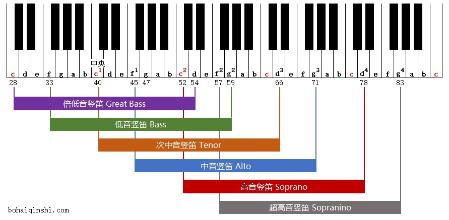

# 竖笛 Recorder

## 竖笛的音域

## 竖笛的选择 非专业

一般选英式竖笛。只有高音和中音竖笛有德式，其它的竖笛全都是英式指法。

木质音色好于塑料的，一般同级别下是这样的。木质的手感也远好于塑料的。但木质的更难保养。

雅马哈的塑料竖笛，价格一百多，但网店上卖的假货较多，便宜的基本都是假货。要选日产的，价格一百多的，有个印尼产的几十块质量也稍差些。

奇美竖笛，选木质的，价格约四十。看评测可能有少数一两个因不够准，此牌子品控不行。

aulos 日产，挺贵

其他欧美的牌子，不过价格较贵

日常娱乐选奇美木笛或者雅马哈即可。
